#  Autoscaling and Load Balancer

**Autoscaling** is a process that automatically adjusts the amount of computing resources (like servers or virtual machines) based on the amount of work or traffic that needs to be handled.
 
 
Autoscaling typically uses rules to decide when to add or remove resources. For example, if the server's CPU usage goes over 70%, it might add another server to help. Once the usage drops below a certain level, it removes the extra server.

 
 
 
 
A **load balancer** is like a traffic director that distributes incoming requests (like users trying to visit your website) across multiple servers so no single server gets overwhelmed.
 
 
A load balancer sits between the users and the servers. When a user sends a request (like visiting a website), the load balancer decides which server should handle that request. It can choose the server that's least busy or use other methods to balance the load.

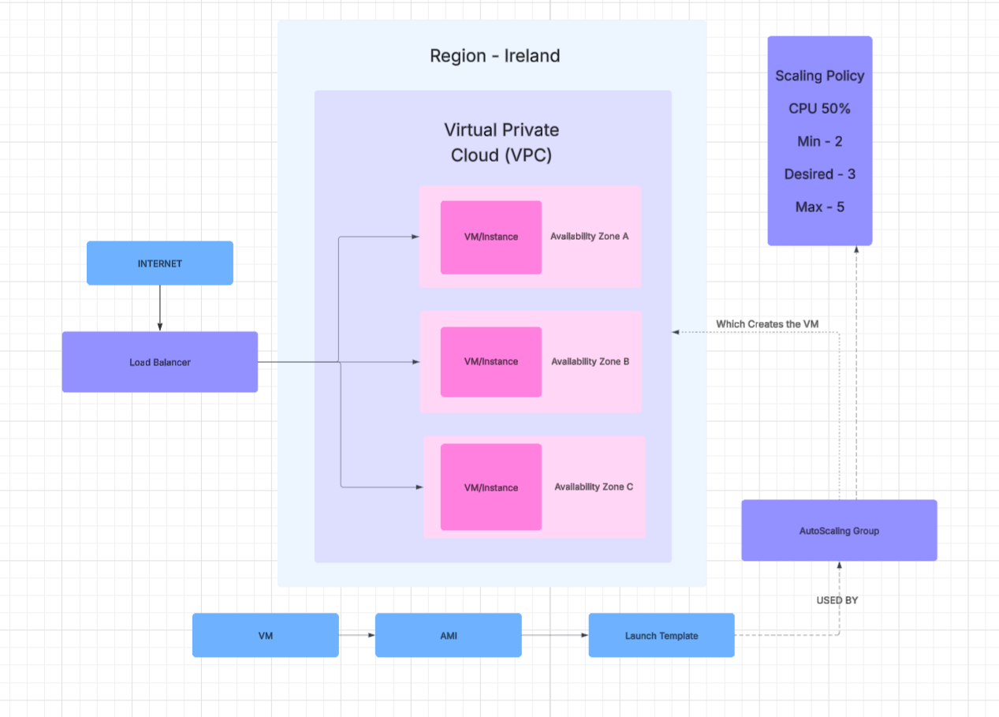

 
 
 
 

# How to create an autoscaling system

 
 

- Create an instance and an AMI template. Please see [AMI Guide](https://github.com/BColl91/SpartaG_Github_Notes/blob/main/ami_notes.md) before continuing.
  
- On your dashboard, along the left, go to Instances and select Launch Templates
  
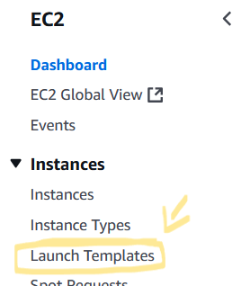
 
 

- Select launch template on the top right.

 
 

- Write out template name and descriotion as appropiate and tick auto scailing guidance.
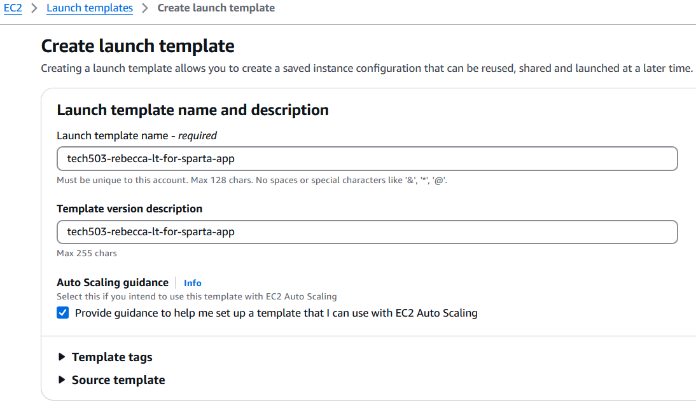
 
 

- Select My AMI, select 'owned by me' and choose the prefered AMI from the dropdown.

 
 

- Select the appropiate instance type *(in this case its t2.micro)*

 
 

- select the appropiate key-pair.
- Select the appropiate existing security group.
- 
 
 
- Add a resource tag that matches the template name *(This labels the template)*

 
 

- Scroll down to advanced settings, then scroll to User Data and add your script *(Example is shown)*
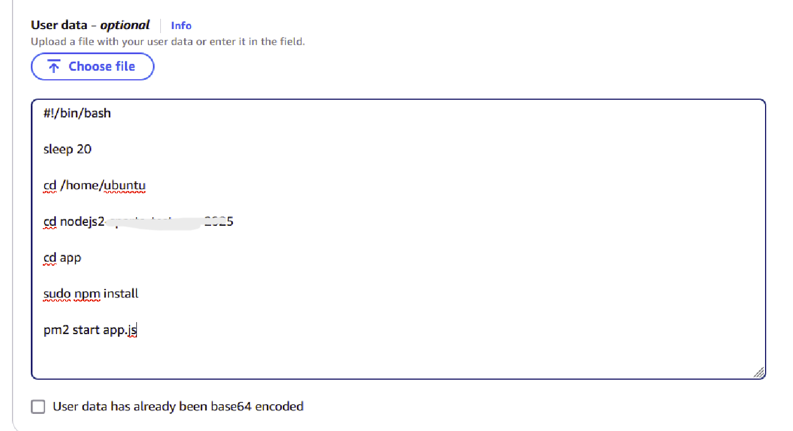
 
 

- Check you are happy woth the summery and click launch template when ready.
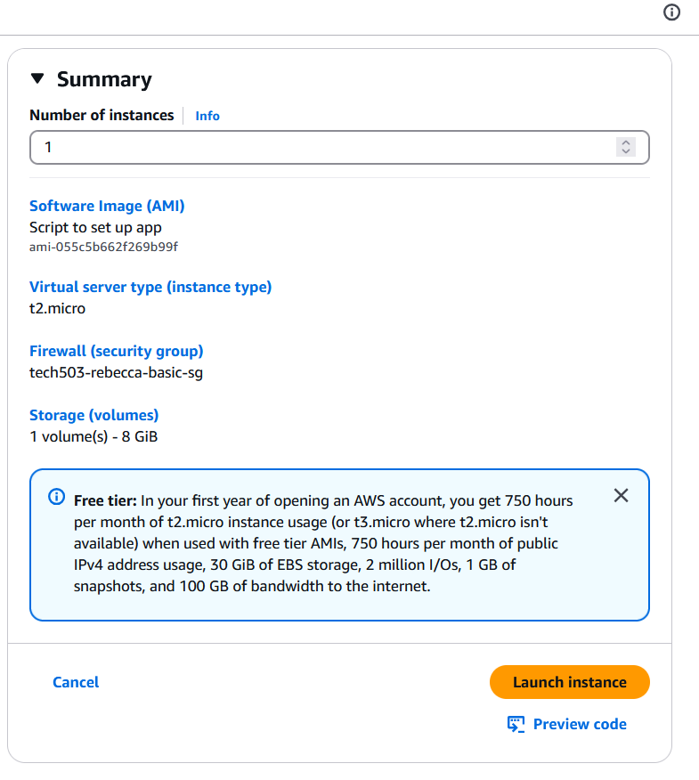
 
 

- Here is what the details of a complete template look like:
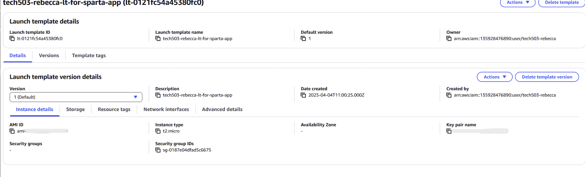
 
 

- While here select actions then choose launch instance from template.
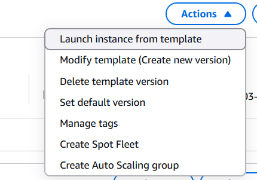
 
 

- Confirm that all details on the next page are correct before proceeding by slecting launch instance.
- Along the left of the screen go to Autoscaling groups.

 
 

- Write out an appropiate ASG name.
- Select the template you wish to use from the dropdown then click next.
- In the network settings ensure the VPC is default and select the following from the Availabilty Zones and subnets drop down:
  - *DevOPsSudent default 1a*
  - *DevOPsSudent default 1b*
  - *DevOPsSudent default 1c*

 
 

- Keep the distribuition as balanced best effort.
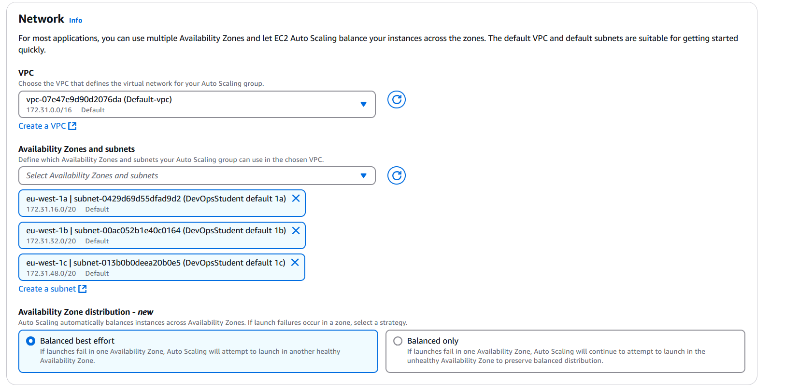
 
 

- Select *attach to a new load balancer* and name as appropiate.
- change the scheme to internet-facing
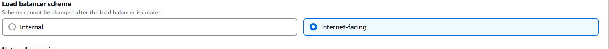
 
 

- Ensure the port is HTTP/80 and create a new Target Group.

 
 

- In Health Checks, tick *turn on elastic load balancing health checks*

 
 

- Choose the appropiate edsired capacity, minimun capacity and maximum. (In this case I chose 2 desired, 2 min and 3 max)
- Change Automatic Scaling to *target tracking scaling policy* and provide a name.
- Keep the metric type as CPU utilization, the target value 50% and the warm up 300 seconds (default)

v

- Scroll down and click next, add a tag with the key *name* and the value being what you wish the label the ASG.
- Check the preview and if it is all correct click create auto scaling group!
- This will take you to a list of active ASGs. Select your own to see the details.

 
 

 
 
 
 

## **----PLEASE NOTE----**

-Remember to be concious of time and cost: the applications would need to be deleted at some point. Heres how:

### LB (Load Balancer)

- Along the left select *load Balancers*

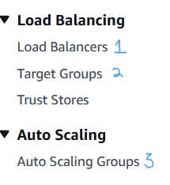
 
 

- Select your LB fromt the list, go to actions and select delete load balancer.
- confirm this by typing in the word as requested.

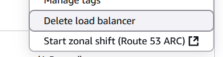

 

### Target Group (TB)
- Along the left select *Target Groups*
- Select your TG from the list, click on Actions and from the drop down choose delete.
- Confirm this by clicking Yes, delete.
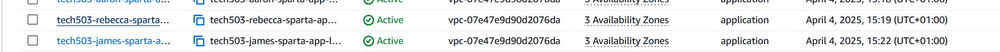
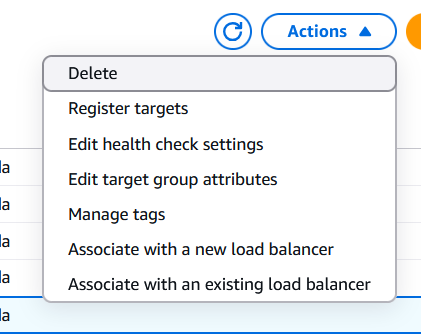

 

### ASG (autoscaling group)
- Along the left select *Auto Scaling Groups*
- Select your ASG from the list
- Confirm the deletion by typing the word as requested then click delete.

