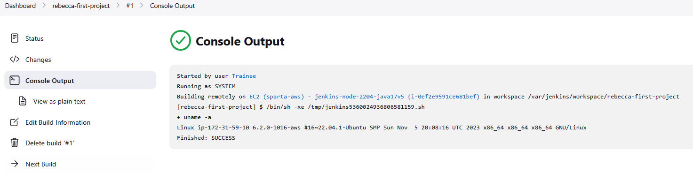

# CI and CD Pipeline

**CI** stands for **Continuous Integration**, and **CD** stands for **Continuous Delivery** (or **Continuous Deployment**).

- **Continuous Integration (CI)**: This is the practice of frequently merging your code changes into a shared repository (e.g., GitHub or GitLab). Every time you make a change, it is automatically tested to ensure it doesn't break anything in the codebase.
  
- **Continuous Delivery/Deployment (CD)**: This means that after the code is tested (via CI), it is automatically prepared and delivered (or deployed) to the production environment without manual intervention. Continuous Deployment goes one step further, deploying the code automatically without any manual review, while Continuous Delivery might have a manual review step before going live.

**CI/CD pipeline** is a series of steps that automates the process of testing, building, and deploying your application. The goal is to speed up software development by automating repetitive tasks like testing, integration, and deployment.


--------

## Jenkins

Jenkins is a tool used to automate the process of Continuous Integration (CI) and Continuous Delivery/Deployment (CD). It's an open-source tool that helps developers automate the building, testing, and deployment of their applications.

Think of Jenkins like a robot assistant that watches your code repository, and when new code is added or changes are made, it automatically builds, tests, and deploys your project for you.

### How Jenkins Works in a CI/CD Pipeline:

Imagine you’re a developer, and you’ve just written some code. Jenkins can automatically do a few important things for you:

- **Detect changes**: Jenkins watches your code repository (like GitHub or GitLab). When you push new code changes, Jenkins sees this and starts working on it right away.

- **Build your code**: Jenkins then runs a "build" job. This means it compiles your code (or sets up your app) to make sure it's ready for testing or deployment.

- **Test your code**: After building the code, Jenkins can run tests (like checking if your app works as expected) to make sure you didn't break anything with the new code.

- **Deploy your code**: If everything goes well (the build and tests pass), Jenkins can automatically deploy your code to a live server or a staging server where users can try it out.


-------

# Setting up a CI/CD Pipeline with Jenkins

- To get started you will first need to register/login to Jenkins. It should then take you to a dashboard similar to the screenshot below:

*Note:- for this case you might need to put your instance ip address in the url then <:8080>*


<br>
<br>

- From the left hand side select *New Item* and name your new project as appropiate. (*e.g:- rebecca-first-project*)
- Select *Freestyle Project* and click ok to continue.


<br>
<br>

- Write an imformative description to explain what the job/project entails.


<br>
<br>

- Select "Discard old builds* and in *Max # of build to keep* put in 3.

<br>
<br>

- Scroll down to Build Steps and select *Add Build Step*.
- In the drowpdown list, select *ssh* and add your command/script to the input box.
- Click save to contine.


<br>
<br>

- Along the left hand side select *build now*. This should start the project.
- You can see the progress below build history. To see more details, hover the curse over the number, click on the dropdown box and select *Console Output*



<br>
<br>

### Creating a Pipeline

- Select *New Item* from the left hand side and start creating a new project.
- Continue creating your second project in the same manner as before and when complete, run *build now* to test it.
- Go to *Dashboard* and select your first project.


<br>
<br>

- Select *Configure*


<br>
<br>

- Scroll fown to Post Build Actions and select *Add post-build action*
- in the drop-down box select *Build other projects*
- A new feild will appear. Type in the name of the project you wish to connect to.
- Select as desired from the drop-down box
- Select *Trigger only if build is stable*
- click *save*


<br>
<br>

- To check if it is successfull, go to your dashboard and select *last success* to bring the latest projects to the top.
- You can also select your first project to check the details and confirm.


<br>
<br>

  -----

  ### Creating an ssh key-pair

  - Open git bash
  - Navigate to your .ssh folder
 - Label the title of your key as appropiate and type in the following command:
  - ```
    ssh-keygen -t rsa -b 4096 -C "placeholder@email.com"
    ```
  - Change the email address to your own.


-This will generate a public/private key pair.
- label as appropiate (*e.g:- tech503-rebecca-github-key-jenkins*)
- Keep the passphrase empty by pressing enter.
- to check if this has worked. Type in the command `ls`
- You can locate your key in git bash using `cat <git-bash-key-name>` which will show you the relevent key.
- Go to github and to the repo you wish to use.
- Go to your repo settings.

<br>
<br>

- Select *Deploy Keys*


<br>
<br>

- click *add key*
- type in your password to confirm.
> ⚠️**PLEASE NOTE** You can only use one key per repo! ⚠️
> 

<br>
<br>

- Go to Jenkins and create a new project.
- Continue as previously done until you reach *GitHub Project*. Select it.
- In *Project url* put in your repo url (*you can use the url displayed from the site page*)


<br>
<br>

- Scroll down to *Source Code Management* and select *Git*
- In *Repository URL* paste in the **ssh url from your repository** as shown in the below screenshot.

<br>
<br>

- Select *Add Credentials* and change the Kind to *SSH Username with private key*


<br>
<br>

- Label your *ID, Description and Username* as appropiate.


<br>
<br>

- Scroll to Private Key and select *Enter directly*
- Paste in the **private key** from your git bash terminal into the input box ash shown below.


<br>
<br>

- Click *add* then select your labeled key from the drop-down list.


<br>
<br>

- Change Branch Specifier to `*/main`


<br>
<br>

- Scroll down and select *Add Build Step*
- Select *Execute shell* from the drop-down box and type in 'ls' in the command box to check if it is connected to your github repo.
- Select *save* to continue then select *Build Now* to see if it is running.


<br>
<br>

- Go to your projects *Console Output* them select *Configure*
- Scroll to Build Enviroment and select *Provide Node & npm bin/folder to PATH*
- Change NodeJS version to **20**


<br>
<br>

- In Build Steps, type the following into the command box:-
```
ls
cd app
npm iinstall
npm test
```


<br>
<br>

- Click save to continue.
- 


<br>
<br>

-


