# Cloudwatch Dashboard
CloudWatch Dashboards give you a customizable, unified view of your AWS resources. Here’s how to create one for your EC2 instance.
---------------

**Create an Instance**

- Launch an instance as normal and provide an appropiate name.
- Below that select 'My AMIs', 'pwned by me' and use the drop down box to locate your AMI.
- Ensure that you have the right key and security group.

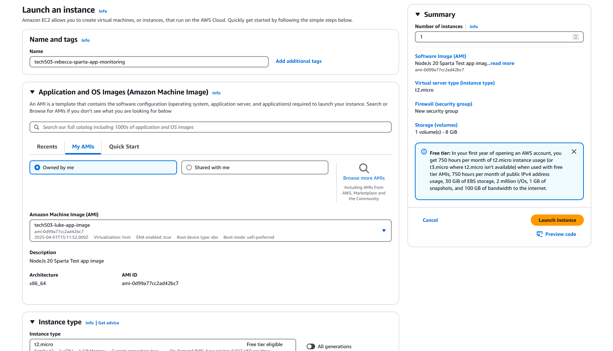

 
 

- Go to the bottom of the page and open advanced settings.
- Go to 'User Data' and put in your script (ensure you ahve shebang along the top to run the script)
- - Double check your details and select launch.

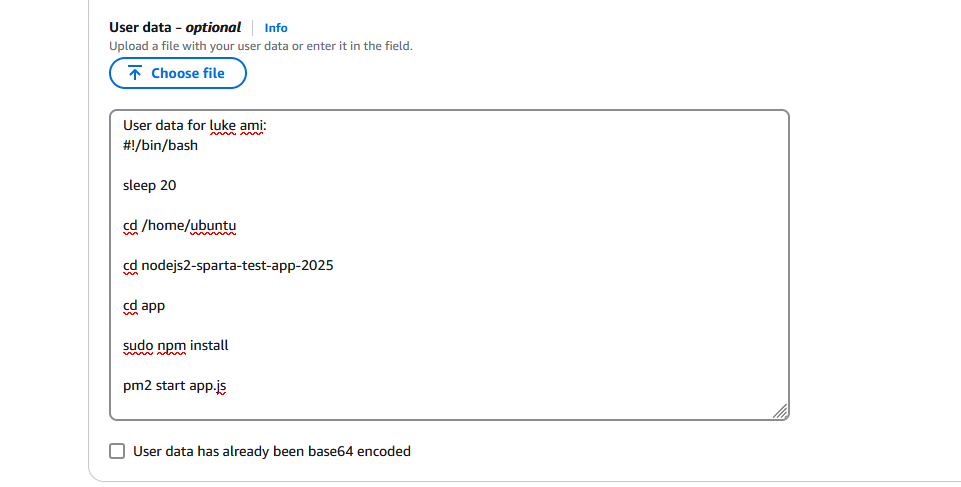

 
 

**Navigate to detaled monitoring to setup a dashboard**

- select your instance until you reach the summary.
- scroll down and locate the *Monitoring* tab.
- Select Manage detailed monitoring.

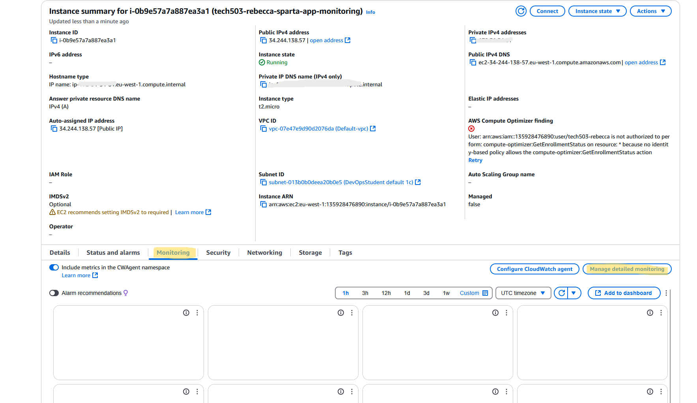

 
 

- tick the box and confirm.

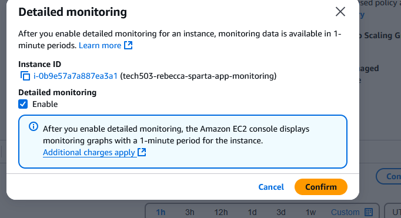

 
 

- Select add to dashboard then create new.
- Name your dashboard as appropiate and click create.
- click add to dashboard to confirm.

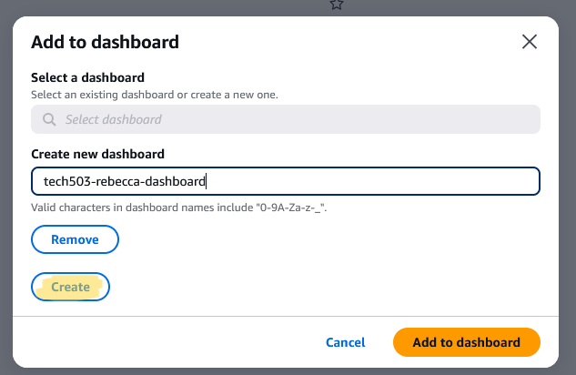

 
 

This is your dashboard! You can change how often it refreshes along the top right, along with how far back you want to view data. You can also change the layout to your preference.

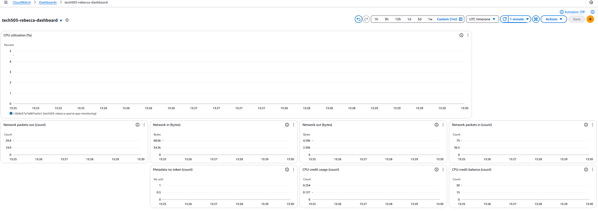

--------------------
 
# Setting an alarm

 

- go to your cloudwatch homepage and select create alarms.

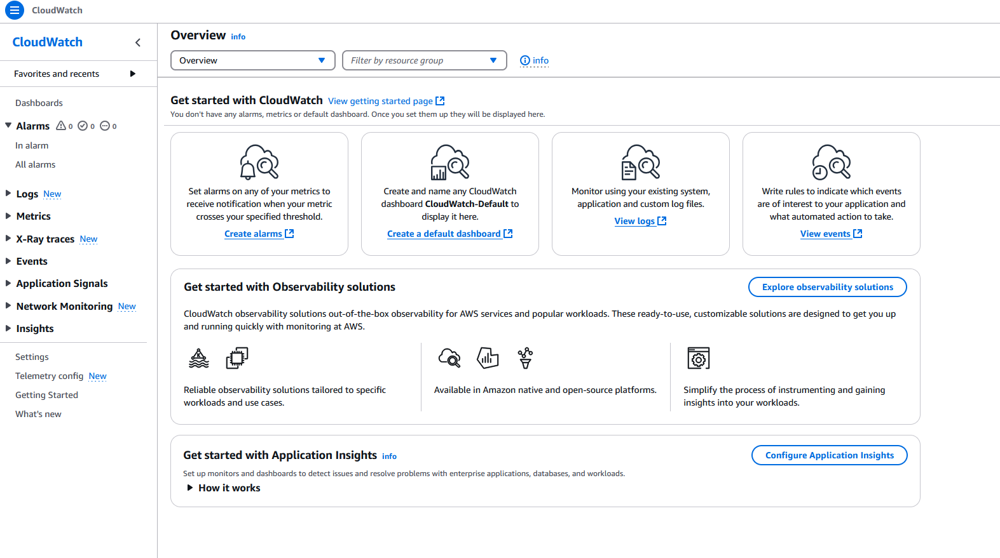

 
 

- Follow the guideline and select Metric

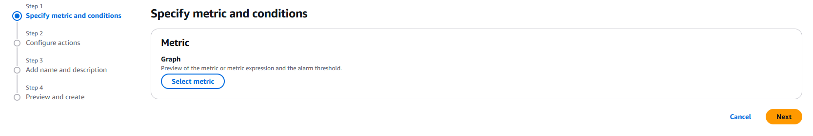

 
 

- Select EC2

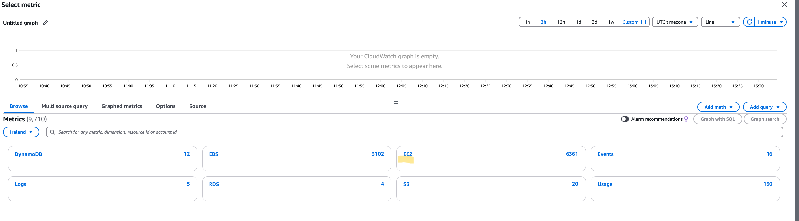

 
 

- Select Per-Instance Metrics

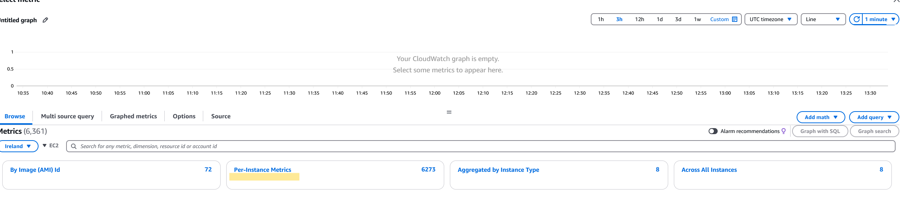

 
 

- Filter the Metrics with your name/label and locate CPUUtilization to select

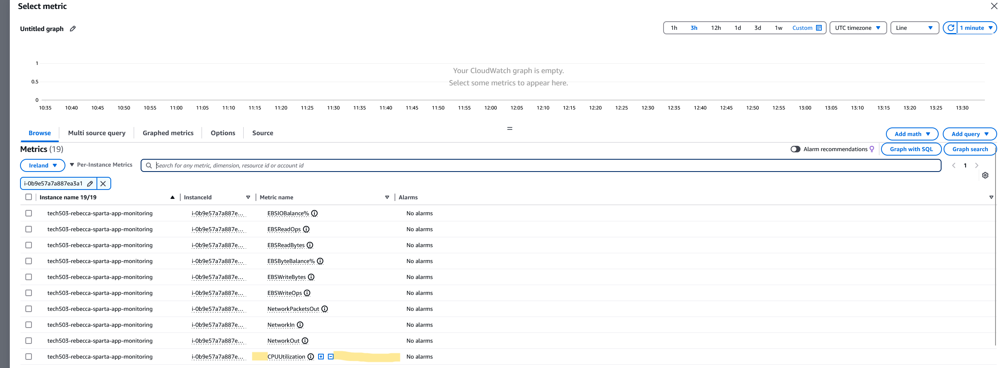

 
 

- Change the period as advices (e.g.- 5mins) and ensure the conditions are set to Static, Greater (or Greater/Equal) and type what percentage you want this to trigger.

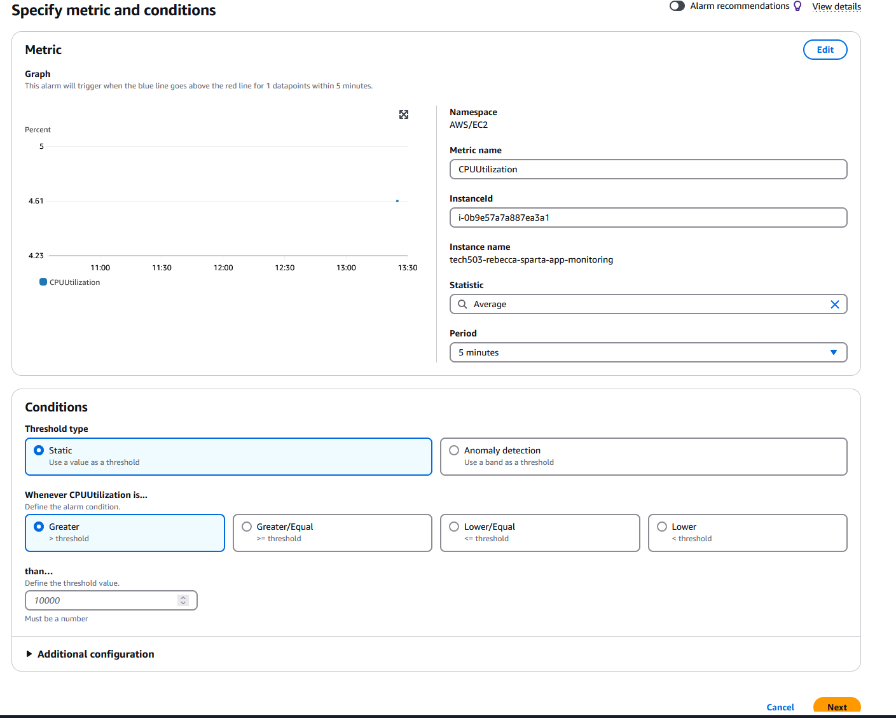

 
 

- Ensure the Configure Actions are In Alarm and create a new topic with a relative an dappropiate name.
- -add an email to receive the notification.

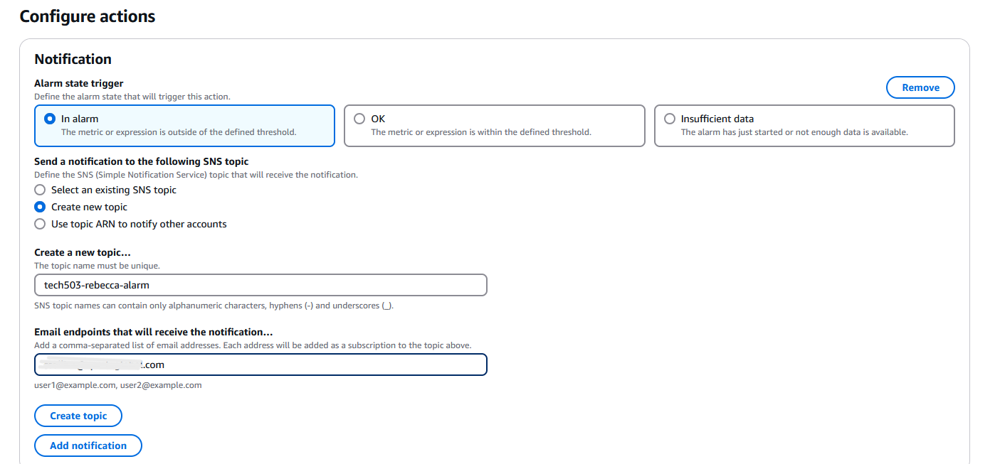

 
 

- Once done you can quickly check your email.

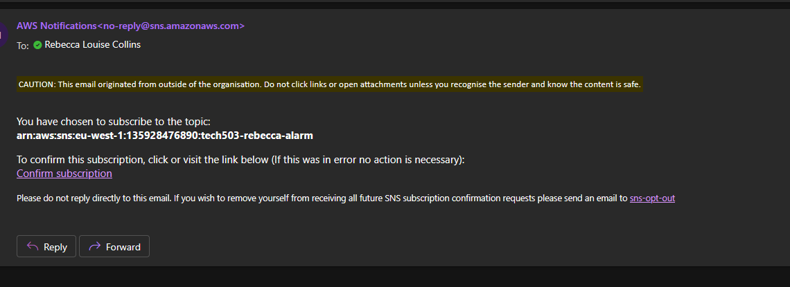

 
 

- Check if the preveiw is correct and continue.
- If the details match your expectations select create alarm.

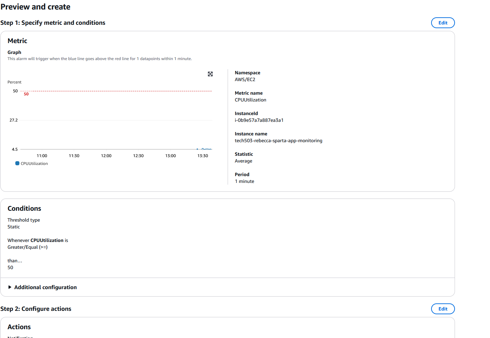

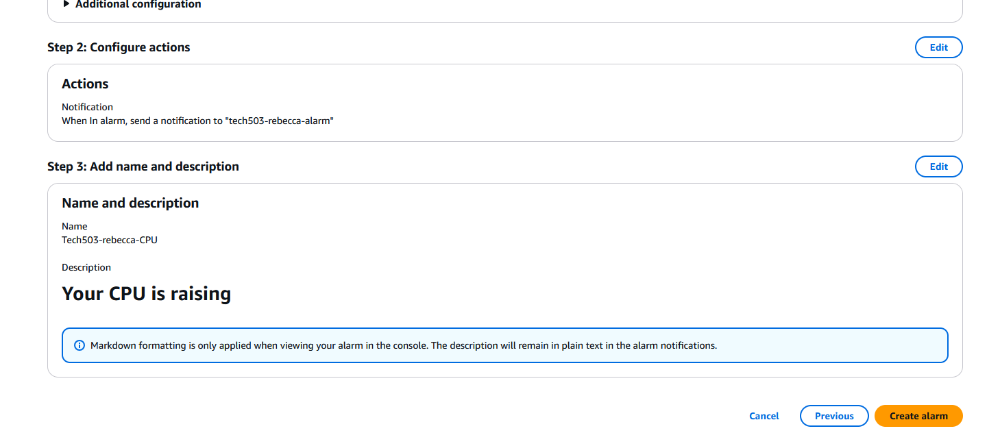