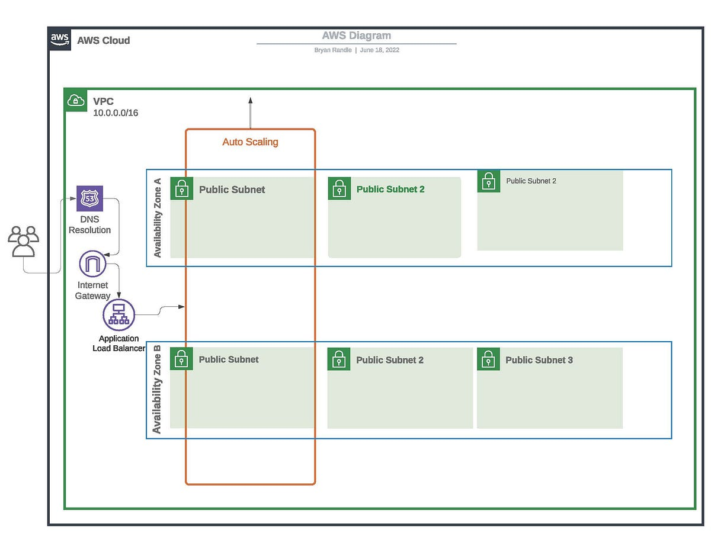

### What are VPCs?

A **Virtual Private Cloud (VPC)** is an isolated network within a cloud environment (e.g., AWS, Google Cloud, Azure) that allows you to define and control your own virtual network, including IP address ranges, subnets, route tables, and security settings. 

A VPC provides a secure, customizable environment for your cloud resources, and you control the networking aspects of your infrastructure.

When you create a VPC, it is isolated from other virtual networks in the cloud. This means your cloud resources within the VPC (such as virtual machines, databases, etc.) can't directly communicate with resources outside the VPC unless you explicitly allow it. You have full control over the network's architecture.

### Components of VPC:

- **Subnets**: Subnets are subdivisions within a VPC's IP address range that help organize and control the flow of network traffic. These subnets can be public (accessible from the internet) or private (isolated from the internet).

- **Public vs Private Subnets**: 
  - **Public Subnets** are subnets that have direct access to the internet through an Internet Gateway (IGW). They're typically used for resources like web servers.
  - **Private Subnets** do not have direct access to the internet. They're used for resources that don't need public access, such as databases or application servers.

- **CIDR Blocks**: A **Classless Inter-Domain Routing (CIDR) block** is a notation that specifies the IP address range for a VPC (e.g., 10.0.0.0/16). It defines the number of available IP addresses in the range.

- **Internet Gateways (IGW)**: An **Internet Gateway** allows communication between resources in your VPC and the internet. It’s attached to a VPC and enables public internet access for resources in public subnets.

- **Route Tables**: **Route Tables** are used to direct network traffic between subnets and external destinations (e.g., the internet, other VPCs). Routes define where traffic is directed based on the destination IP address.

- **Security Groups (SG)**: A **Security Group** is a virtual firewall that controls inbound and outbound traffic to instances. At the *instance level*, SGs allow or deny traffic based on rules you define (e.g., permitting only HTTP traffic to a web server). Security groups are stateful, meaning if an inbound request is allowed, the corresponding outbound response is automatically allowed, regardless of outbound rules.

-------------------

### How do VPCs help a business?
VPCs provide businesses with full control over their cloud networking environment, enabling them to securely launch and manage resources (like EC2 instances) in a private, isolated space that mirrors their on-premises network. Besides security, it also provides scalability and customisation.

### How do VPCs help DevOps?
For DevOps, VPCs enable the creation of scalable, secure, and flexible environments for deploying applications, automating network management, and managing traffic flow between development, testing, and production resources in the cloud.

### Why did AWS feel the need to introduce VPCs?
AWS introduced VPCs to give users more control over their cloud network's configuration, improving security, isolation, and the ability to mimic traditional on-premises network setups while leveraging the scalability and flexibility of the cloud.

__________

## Further Notes

#### Why is a VPC useful?

**Security**: Since it's isolated, you can control which resources have access to the internet, other resources in your VPC, or even on-premise systems. This enables strong network security policies.

**Customisation**: You can customise the network structure, including IP ranges, subnets, routing policies, and more, according to your needs.

**Scalability**: You can scale your network by adding more subnets, and cloud resources, and adjusting route tables as your infrastructure grows.