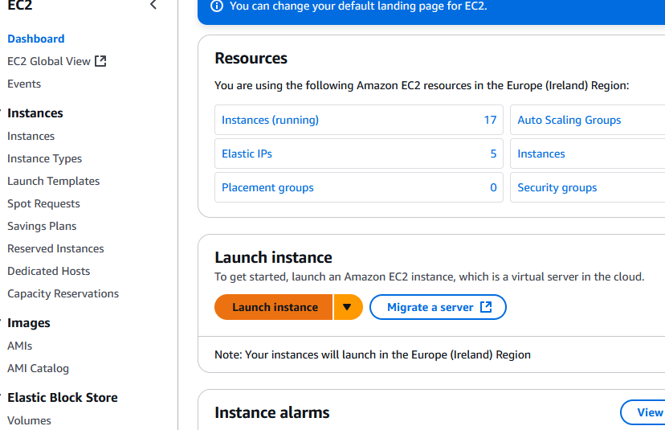
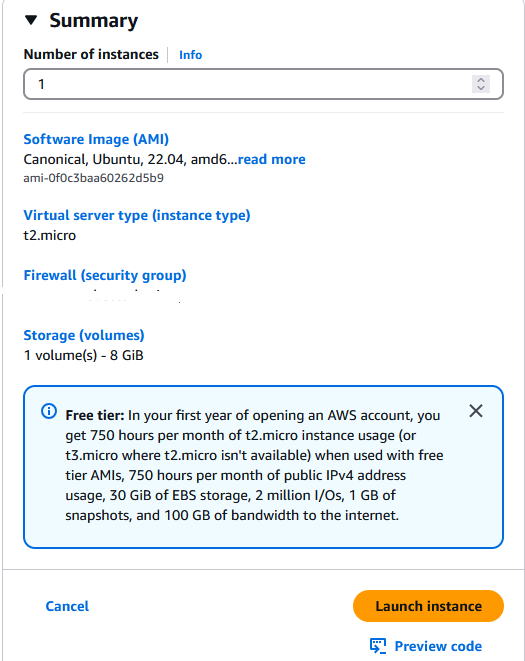
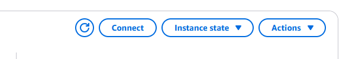

# Document Images
 

## What are Document Images?

 
In the context of databases, servers, or cloud computing, a document image could refer to a snapshot or representation of a particular environment or instance. This term is commonly used for things like AMIs (Amazon Machine Images) or Docker images, which are used to deploy applications or infrastructure.
 
However, the phrase "document image" is a bit ambiguous. It could be referring to actual document files (like PDFs, Word files, etc.) or it could be related to server images that store configurations, applications, or services.
 
In cloud computing (like AWS), Document Images (AMIs) are pre-configured images of servers that include everything you need to run an application (OS, apps, services, configurations).

Regarding AMIs (Amazon Machine Images), they allow you to:
- Reuse server setups.
- Quickly scale your infrastructure.
- Deploy environments with pre-configured settings.
    
## How Do They Work?

- **Create an Image**: You can take a snapshot of a running server or instance (like an EC2 instance on AWS), and this snapshot gets turned into an image.
- **Launch from Image**: You can then create new instances or servers based on that image. This ensures consistency, as the new instances are identical to the one from which the image was made.
    
Why are Document Images Helpful for a Business?
- **Consistency**: They ensure that your infrastructure is always configured the same way. You can deploy new servers quickly, all with the same settings.
- **Efficiency**: If you need to scale or duplicate environments, you can quickly spin up a new server from an image.
- **Backup and Recovery**: You can use images as backups of your environments, so you can quickly restore to a known good state.
________________

# How to create a Document Image
 

    1. Launch an EC2 instance: Start with a basic server.
   

    2. Configure the server: Install necessary software, configurations, and dependencies.
   
    3. Create an image:
        ○ On the EC2 dashboard, right-click the instance.
        ○ Select Create Image.
        ○ AWS will snapshot the server, including all files and configurations.
Save the Image: Your image will be saved, and you can use it to launch new instances

 

# Using a Document Image
 

    • Launch from an Image:
        1. In your cloud platform (AWS, for instance), navigate to the AMI section.
        2. Select your saved image and choose to launch a new instance based on it.
The new instance will inherit all configurations, software, and settings from the image.